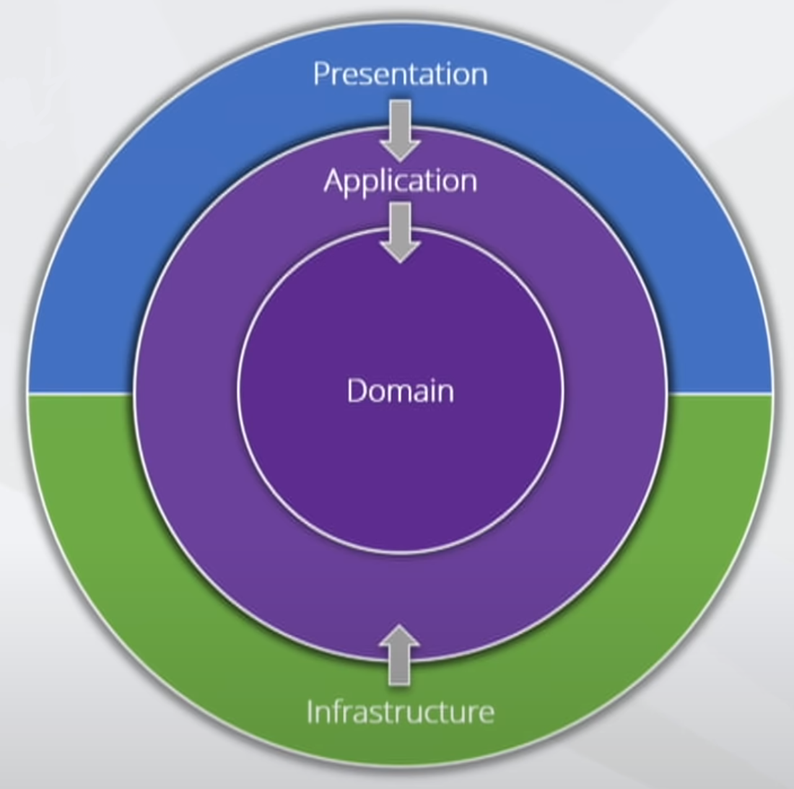

# Restaurant-WebApi
Practice Rest Web Api, Clean Architecture,  CQRS+ MediatR, logger, authentication, authorization, automated tests, azure cloud, ci/cd pipelines

## API - What it is ?
    - API (Application Programming Interface), is a set of definitions and protocols that enable one application or system to communicate and cooperate with others. You can think of it as a set of rule that define how different software components should work together.
    - Key guidelines for REST API design : 
        + Stateless 
        + Cacheable
        + Layerd system
        + Uniformed interface 
        + HATEOAS

## Status code
- 1xx : Informational 
- 2xx : Success
- 3xx : Redirection 
- 4xx : Client Error    
- 5xx : Server Error

| Code  | Code Name                     | Description                                                                                                                                   |
|-------|-------------------------------|-----------------------------------------------------------------------------------------------------------------------------------------------|
| 100   | Continue                      | The request has been received and is being processed.                                                                                         |
| 101   | Switching Protocols           | The server is switching protocols to a different protocol, such as HTTPS.                                                                     |
| 102   | Processing                    | The server is still processing the request and has not yet completed it.                                                                      |
| 103   | Early Hints                   | The server is sending some preliminary information that may be useful to the client, such as the. Content-Type or Content-Encoding headers.   |
| 200   | Ok                            | The request has been successfully processed and the response is being sent.                                                                   |
| 201   | Created                       | The request has been successfully processed and new resource has been created                                                                 | 
| 202   | Accepted                      | The request has been accepted for processing, but the processing has not been completed.                                                      |
| 203   | Non-Authoritative Information | The response is from a cache and may not be up-to-date.                                                                                       |
| 204   | No Content                    | The request was successful, but the response has no content                                                                                   |
| 300   | Multiple Choices              | The request has multiple possible responses and the user agent should choose one of them.                                                     | 
| 301   | Moved Permanently             | The requested resource has been permanently moved to a new location .                                                                         | 
| 302   | Found                         | The requested resource has been temporarily moved to a new location .                                                                         |
| 303   | See Other                     | The user agent should retrieve the requested resource using another URI.                                                                      |
| 304   | Not Modified                  | The requested resource has not been modified since the last time it was retrieved by the user agent.                                          |
| 400   | Bad Request                   | The request was invalid and could not be parsed.                                                                                              |
| 401   | Unauthorized                  | The request requires authentication.                                                                                                          |
| 403   | Forbidden                     | The request is forbidden and cannot be fulfilled.                                                                                             |
| 404   | Not found                     | The request resource does not exist.                                                                                                          |
| 409   | Conflict                      | The request could not be completed due to a conflict.                                                                                         |
| 500   | Internal Server Error         | An unexpected error occurred on the server.                                                                                                   |
| 501   | Not Implemented               | The server does not support the functionality required to fulfill the request.                                                                |
| 502   | Bad Gateway                   | The server, acting as a gateway or proxy, received an invalid response from the upstream server.                                              |
| 503   | Service Unavailable           | The server is currently unavailable (overloaded or down for maintenance).                                                                     |
| 504   | Gateway Timeout               | The server, acting as a                                                                                                                       |

## Clean Architecture 

    - Benefits : 
        + Testability   
        + UI independence
        + Free to choose / change the database
        + Flexibility 
        + Transparency 

## CQRS 
    - Command/Query Responsibility Segregation -a design pattern that segregates responsibilities depending on whether a given operation writes or retrieves data.
    - By specific division of responsibilities, we will obtain simple class implementations with a minimum number of dependencies.

|                Command                        |               Query                       | 
|-----------------------------------------------|-------------------------------------------|
|- Responsible only for writing/saving the data |- Responsible only for retrieving the data |
|- Validates the model                          |- Checks the request context               |
|- Processes application logic                  |- It is idempotent                         |

    => Implementation of CQRS : 
        1. Installing MediatR package : MediatR, based on the mediator's pattern, will easily enable us to implement CQRS, using classes representing commands and query
        2. Creating concrete classes : We will add classes to our walkthrough representing commands and queries and their handlers, using special interfaces and base classes made available from Mediata package
        3. Registration and use of the MediatR : We'll register created classes and the mediator itself, then using the IMediator interface we will be able to send these commands/queries.
## Authorization 
    - Authorization is the process of granting or denying access to resources and functionalities within a web application based on the user's identity, role, or permissions.

        

